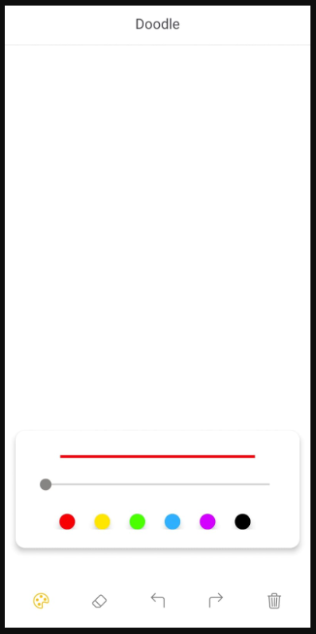

<h1><b>What is Doodle?</b></h1>

My Android app, called 'Doodle,' lets you create colourful doodles effortlessly.
With a variety of colours and brush sizes, you can unleash your creativity and
draw whatever you like. Mistakes are no problem, as you can easily undo, redo, or
erase any part of your masterpiece. Feeling stuck? Just clear the entire canvas and
start anew! Doodle is perfect for kids and adults alike, offering a fun and relaxing
way to express yourself. Whether it's doodling for fun or creating something
special, my app makes it simple and enjoyable.

<h2><b>Demonstration</b></h2>

Note: The GIF attached here for the demonstration may take few seconds (approx. <10s) to load.

<h2><b>1. App Manifest</b></h2>
<h3><b>AndroidManifest.xml:</b></h3>

The following code snippet is a part of my Android app's manifest file, where it
configures certain attributes for the app. android:label="@string/app_name" sets
the app's name, typically defined in a string resource.  
<code>android:label="@string/app_name"
 android:roundIcon="@mipmap/ic_launcher_round"
 android:theme="@style/Base.Theme.Doodle.Light"</code>  
android:roundIcon="@mipmap/ic_launcher_round" specifies the round icon
displayed on the home screen, while
android:theme="@style/Base.Theme.Doodle.Light" defines the app's visual
theme, suggesting a light-themed user interface.

<h2><b>2. Layout Anatomy</b></h2>
<h3><b>activity_main.xml:</b></h3>

The activity_main.xml defines the layout
for the main interface of my android app.
It starts with a top-level LinearLayout
serving as the root view. This root layout
takes up the entire screen, providing a
white background and aligning its
content at the top. Within this layout,
there's a TextView element displaying the
title "Doodle" at the top centre of the
screen, followed by a horizontal line as a
separator.

Below the title and separator, a nested
LinearLayout is used to organise the
main content of the app. This section
primarily consists of a custom
DrawingView, which occupies most of
the screen space, allowing users to draw.
The DrawingView is followed by an
androidx.cardview.widget.CardView,
which encapsulates various drawing tools and settings. This card view has a white background and rounded corners.

</img>

Within the CardView, there's another LinearLayout that contains the following
drawing tools and settings: 

1. A custom LineImageView displaying a visual representation of the brush
or line thickness.
2. A SeekBar allowing users to adjust the brush thickness.
3. A horizontal LinearLayout containing colour selection buttons, each
represented by a MaterialButton. The available colours include red, yellow,
green, blue, purple, and black.

At the bottom of the screen, there's yet another LinearLayout containing icons as
ImageButton elements. These icons represent various actions related to drawing: 

1. A brush icon (`@drawable/brush`) for selecting the drawing tool.
2. An eraser icon (`@drawable/eraser`) for erasing.
3. An undo icon (`@drawable/arrow_left`) for undoing the last action.
4. A redo icon (`@drawable/arrow_right`) for redoing the last undone
action.
5. A trash icon (`@drawable/trash`) for clearing the drawing.

<h2><b>2. The Graphics API</b></h2>

Before I explain the graphics API, let me provide a brief explanation of each of the
source code files. My app consists of three main Java files: MainActivity.java,
LineImageView.java, and DrawingView.java Let’s briefly discuss the purpose of
each file:

The MainActivity is responsible for initialising and managing various user
interface elements and their behaviours. These elements include buttons for the
palette, eraser, undo, redo, and clear actions, as well as colour selection buttons.
The code handles user interactions such as button clicks to change drawing
settings, toggle the visibility of a drawing palette, and manage drawing actions like
clearing and undoing. It also includes a method for displaying an alert dialog
when the "Clear" button is pressed, prompting the user to confirm the action.

The LineImageView custom view is designed to provide a visual representation of
the chosen options for various colours and stroke widths.

Lastly, the DrawingView class is responsible for creating a drawing and sketching
interface within the app, allowing users to draw lines with customizable colours
and stroke widths, support undo and redo actions, and clear the drawing canvas.

Let's discuss the core part of each of the Java files:

<h3><b>MainActivity.java:</b></h3>

To display SVG formatted icons as images for the brush (or palette), erase, redo,
undo, and clear ImageButtons, I have created drawables from XML vector
graphics by loading the SVG formatted icons as vector assets. This enables me to
dynamically change the properties of the icons, such as altering the colour of the
Image button once it's been clicked, using the VectorDrawable object, as shown in
the following code snippet:

<code>VectorDrawable object = (VectorDrawable)
ContextCompat.getDrawable(MainActivity.this, R.drawable.name);</code>

When a user clicks the 'Clear' button in the alert dialog box to erase the entire
drawing, the clearDrawing() method in the DrawingView class is invoked to
delete all the drawing paths on the canvas.

<code>builder.setMessage("Are you sure you want to clear this doodle?")
&#9;.setPositiveButton("Clear", new DialogInterface.OnClickListener() {
&#9;public void onClick(DialogInterface dialog, int whichButton) {
&#9;drawingView.clearDrawing();
&#9;}
})</code>

<h3><b>LineImageView.java:</b></h3>

The Canvas is responsible for specifying what to draw, while the Paint determines
how to draw it. For example, the Canvas provides methods for drawing shapes like
lines and rectangles, while the Paint defines attributes such as colour, style, and
font for those shapes. In essence, Canvas defines the shapes you can display on the
screen, while Paint specifies the visual properties of each shape you draw. The
init() method is called within the LineImageView constructor to initialise the
Paint object, allowing for customization of the visual representation based on user
choices.

<code>private void init() {
&#9;linePaint = new Paint();
&#9;linePaint.setColor(lineColor);
&#9;linePaint.setStrokeWidth(lineStroke);
&#9;linePaint.setStyle(Paint.Style.STROKE);
}</code>

Every view implements onDraw(), which takes a Canvas object as an argument.
The Canvas provides various primitive shapes, such as drawLine(). Here's the
code that draws a fixed-size static horizontal line using the linePaint object.

<code>@Override
protected void onDraw(Canvas canvas) {
&#9;super.onDraw(canvas);
&#9;int centerY = getHeight() / 2;
&#9;canvas.drawLine(0, centerY, getWidth(), centerY, linePaint);
}</code>

<h3><b>DrawingView.java:</b></h3>

The DrawingView allows users to draw freehand lines with customizable colours
and stroke widths, supports undo and redo actions, clearing the drawing canvas,
and erasing functionality. This view utilises the Path class, which is used for
drawing more complex shapes. Shapes can be defined by adding lines and curves
to a Path object, which can then be drawn using drawPath(). Similar to primitive
shapes, paths can be outlined, filled, or both, depending on the setStyle().

<code>private void setupDrawing() {
&#9;drawPath = new Path();
&#9;drawPaint = new Paint();
&#9;drawPaint.setAntiAlias(true);
&#9;drawPaint.setStyle(Paint.Style.STROKE);
&#9;drawPaint.setStrokeJoin(Paint.Join.ROUND);
&#9;drawPaint.setStrokeCap(Paint.Cap.ROUND);
&#9;drawPaint.setStrokeWidth(strokeWidth);
}</code>

The provided above code snippet initialises a single Paint and a Path object, which
represent the user's current drawing path and paint settings when the app starts.
The Path is used to draw complex shapes by tracking X and Y coordinates, such as
creating freehand lines as the user interacts within the canvas.

<code>@Override
public boolean onTouchEvent(MotionEvent event) {
&#9;float touchX = event.getX();
&#9;float touchY = event.getY();
&#9;switch (event.getAction()) {
&#9;&#9;case MotionEvent.ACTION_DOWN:
&#9;&#9;&#9;undonePaths.clear();
&#9;&#9;&#9;drawPath.reset();
&#9;&#9;&#9;drawPath.moveTo(touchX, touchY);
&#9;&#9;&#9;break;
&#9;&#9;case MotionEvent.ACTION_MOVE:
&#9;&#9;&#9;drawPath.lineTo(touchX, touchY);
&#9;&#9;&#9;break;
&#9;&#9;case MotionEvent.ACTION_UP:
&#9;&#9;&#9;Paint pathPaint = new Paint(drawPaint);
&#9;&#9;&#9;pathHistory.push(new PathWithStyle(new Path(drawPath), pathPaint));
&#9;&#9;&#9;drawPath.reset();
&#9;&#9;&#9;break;
&#9;&#9;default:
&#9;&#9;&#9;return false;
&#9;}
&#9;invalidate();
&#9;return true;
}</code>

The onTouchEvent() method is employed to capture coordinates on the canvas as
the user interacts within it. Utilising the MotionEvent object, this function
determines the user's actions. Three actions are used: ACTION_DOWN when
the user initiates touch within the canvas (where the initial coordinates for
drawing are recorded), ACTION_MOVE when a user interacts within the canvas
(here, lineTo() is used to add a line from the starting coordinates defined by
moveTo() to specific (x, y) coordinates), and ACTION_UP when the user releases
their touch from the canvas.

To address an issue related to the undo and redo operations, I have implemented
an inner class to initialise a new path and paint for each drawing timestep. This
was necessary because I encountered an issue when performing undo or redo
operations, as they would undo or redo the entire drawing at once. Specifically,
when the user performs an undo or redo action on a part of the drawing, every
path is stored in a Stack object called pathHistory, which operates on a FILO
(First-In Last-Out) basis. This allows for the quick retrieval of the most recent
drawing path from pathHistory, which is then passed to the invalidate() method
to refresh and update the canvas drawing.

When the user presses the undo button, the undo() method pops the most recent
drawing path from the pathHistory stack and inserts it into another stack object
called undonePath, which is used to store undo paths. Conversely, when the user
performs a redo action, the most recent undo path is popped from the undonePath 
stack and inserted back into the original pathHistory stack. As usual,
the invalidate() method is employed to refresh the canvas drawings.

